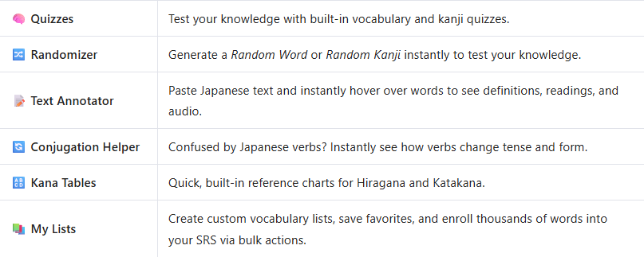

<h1>🎌 分散辞書 · Bunsan Jisho 📖</h1>
<h3><i>Your Advanced Japanese Dictionary & Study Platform</i></h3>

<b>An all-in-one web application designed to help you master Japanese vocabulary, Kanji, and grammar.</b> 
<code>No downloads. No account required. Just open and start learning.</code>

 

 

<h2>📊 Platform by the Numbers</h2>

<table align="center">
<tr>
<th align="center">📚 Vocabulary</th>
<th align="center">🖌️ Kanji</th>
<th align="center">🗣️ Sentences</th>
<th align="center">🛠️ Smart Tools</th>
</tr>
<tr>
<td align="center"><h3>12,340</h3><b>Words</b></td>
<td align="center"><h3>2,600</h3><b>Kanji</b></td>
<td align="center"><h3>140</h3><b>Sentences</b></td>
<td align="center"><h3>20+</h3><b>Study Tools</b></td>
</tr>
</table>

 

 

 

<h2 align="center">✨ Why Learners Love Bunsan Jisho</h2>

<h3>🧠 <b>Intelligent SRS (Spaced Repetition System)</b></h3>

Rote memorization is exhausting. Bunsan Jisho uses a built-in <b>SRS engine</b> that tracks your <i>Due</i>, <i>New</i>, and <i>Total</i> study queues. The system automatically schedules reviews for words exactly when your brain is about to forget them, cementing them into your long-term memory with minimal effort!

<h3>🎯 <b>Precise JLPT Progress Mapping</b></h3>

Studying for the Japanese Language Proficiency Test? The platform tracks your exact vocabulary coverage across all 5 JLPT levels. Watch your progress bars fill up as you conquer thousands of graded dictionary words!

 
<table align="center">
<tr>
<th>Level</th>
<th>Difficulty</th>
<th>Words Covered</th>
</tr>
<tr>
<td>🟢 <b>N5</b></td>
<td>Beginner</td>
<td align="center">744 words</td>
</tr>
<tr>
<td>🟡 <b>N4</b></td>
<td>Elementary</td>
<td align="center">728 words</td>
</tr>
<tr>
<td>🟠 <b>N3</b></td>
<td>Intermediate</td>
<td align="center">1,998 words</td>
</tr>
<tr>
<td>🔴 <b>N2</b></td>
<td>Pre-Advanced</td>
<td align="center">1,747 words</td>
</tr>
<tr>
<td>🟣 <b>N1</b></td>
<td>Advanced / Native</td>
<td align="center">2,544 words</td>
</tr>
</table>

<h3>🎮 <b>Gamified Daily Motivation</b></h3>

Stay consistent! Track your <b>daily streaks</b>, set daily percentage goals, and monitor your dedication with a beautiful <b>12-week activity heatmap</b> (just like GitHub contributions!).

 

<h2 align="center">🛠️ The 20+ "Swiss-Army Knife" Toolkit</h2>

Bunsan Jisho isn't just a dictionary; it's an entire productivity suite for Japanese learners. Access all tools instantly via the <b>Command Palette</b> or Quick Actions!

  

 

<h3>📅 Experience "Word & Kanji of the Day"</h3>

Start every session with fresh material. The app provides a daily featured word and Kanji complete with native audio 🔊, stroke counts, and grade levels.

<blockquote>
<b>洋服 (ようふく / <i>youfuku</i>)</b> 🔊 
📖 <b>Level:</b> N5 | <b>Meaning:</b> Western-style clothes (cf. traditional Japanese clothes) 
 
<b>口 (くち / <i>kuchi</i>)</b> 
🖌️ <b>3 strokes</b> | <b>Grade 1</b> | <b>Readings:</b> ON コウ ク | KUN くち 
📖 <b>Meaning:</b> Mouth
</blockquote>

 

 

<h2 align="center">🔒 Your Privacy is Absolute</h2>

 

In an era of constant data tracking, Bunsan Jisho takes a different approach. <b>Your custom lists, SRS progress, and personal notes live 100% locally in your browser.</b> We do not have servers tracking your study habits, and you never have to hand over your email address.

⚠️ <b>Important Backup Reminder:</b> Because your data is local, clearing your browser cache will erase your progress! The app includes a built-in <b>Backup Reminder</b>. Always use the <code>Export Backup</code> feature to safely download your progress file to your device.

 

<h2 align="center">🚀 Quick Start Guide</h2>

<ol>
<li>🌐 <b>Launch:</b> Visit <a href="https://img2vid.github.io/bunsanjisho" target="_blank"><b>Bunsan Jisho</b></a> in your favorite web browser.</li>
<li>🔍 <b>Explore:</b> Click <code>Browse words</code> to explore the database of over 12,000 entries.</li>
<li>📥 <b>Enroll:</b> Enroll words into your SRS directly from their detail sheets or by creating <i>My Lists</i> and using bulk actions.</li>
<li>🧠 <b>Study:</b> Open your Study Queue and knock out your daily reviews to maintain your streak!</li>
<li>⚡ <b>Pro-Tip:</b> Use the Command Palette to jump to the <i>Text Annotator</i> or <i>Conjugator</i> instantly while reading Japanese articles online.</li>
</ol>

 

 

<h3>🌟 Love the Project?</h3>

If Bunsan Jisho has helped you on your Japanese learning journey, consider sharing it with your study groups, language exchange partners, or classmates!

<b>Happy Studying! 頑張ってください！ (Good luck / Do your best!)</b> 🎌✨

 

<i>Made with ❤️ for the Japanese learning community.</i>

Ask Qwen

